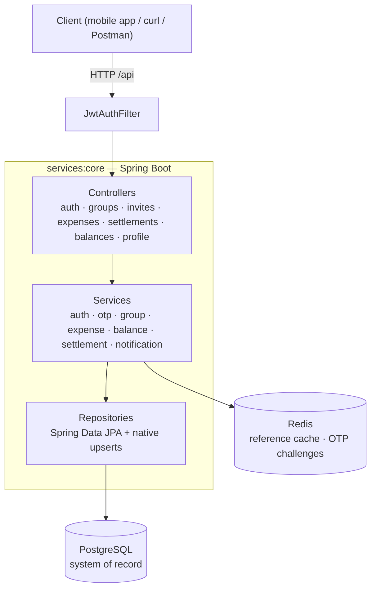

# vyay

> **व्यय** — *expense*. A shared-expense platform backend: groups, splits, balances, and settle-up, built on Spring Boot and PostgreSQL.


`vyay-platform` is the backend for a shared-expenses app: people form groups, invite each other via links, split costs, and settle up. It is a portfolio project, and the emphasis is deliberate — **correct domain modelling, concurrency-safe money movement, and an auditable balance trail**, rather than feature count.

The repository is a **Gradle composite build** currently containing one deployable service (`core`) plus two shared-library modules that are scaffolded for an in-progress split into separate services. See [Where this is going](#where-this-is-going).

---

## Repository layout

```
vyay-platform/
├── settings.gradle.kts          # composite: services:core, libs:vyay-events, libs:vyay-auth-lib
├── build.gradle.kts             # Java 21 toolchain + JUnit platform applied to all subprojects
├── gradle/libs.versions.toml    # version catalog
├── services/
│   └── core/                    # the deployable Spring Boot service (all domain logic today)
└── libs/
    ├── vyay-events/             # shared event contracts        (scaffolded, empty)
    └── vyay-auth-lib/           # shared JWT verification        (scaffolded, empty)
```

Dependency versions are centralised in `gradle/libs.versions.toml`, split into two groups on purpose: artifacts covered by the Spring Boot BOM are declared **without** a version so Boot governs them, and everything outside the BOM is pinned explicitly.

`services/core` source tree:

```
services/core/src/main/
├── java/com/vyay/core/
│   ├── common/security/     # HMAC signer for the balance ledger
│   ├── common/utils/        # money conversion, avatars, invite codes
│   ├── config/              # cache, datasource, password, OTP properties
│   ├── controllers/         # REST endpoints
│   ├── dto/                 # request / response / envelope (one type per file)
│   ├── entity/              # JPA entities: base/, balance/, expense/, group/, settlement/, reference/
│   ├── enums/               # roles, statuses, split types, policies
│   ├── exception/           # typed business exceptions + global handler
│   ├── repository/          # Spring Data JPA + native upserts
│   ├── security/            # JWT service, filter, sealed TokenClaims, security config
│   └── services/            # business logic by domain: auth, group, expense, balance, settlement, notification
├── resources/
│   ├── application.yml
│   └── db/migration/        # Flyway V1–V5
└── Scripts/                 # Node dev tooling & API assertion suite
```

---

## Tech stack

| Layer | Technology |
| --- | --- |
| Language / runtime | Java 21 (toolchain-pinned) |
| Framework | Spring Boot 3.5.4 — Web, Security, Data JPA, Data Redis, Validation |
| Build | Gradle composite build, Kotlin DSL, version catalog |
| Database | PostgreSQL |
| Schema | Flyway versioned migrations, `ddl-auto: validate` |
| Cache / ephemeral state | Redis — reference-data cache, OTP challenges |
| Auth | JWT (jjwt), Spring Security, Google Sign-In |
| Identifiers | UUIDv7 (`uuid-creator`) |
| API docs | springdoc-openapi 2.8.17 |
| Style | Checkstyle (Google Java Style, non-failing) |

---

## Architecture

Today: a single layered service. Controllers handle HTTP, services own business logic and transaction boundaries, repositories talk to the database. PostgreSQL is the system of record; Redis holds cache and short-lived auth state.



**Every balance mutation funnels through one chokepoint.** Expenses and settlements both build a `BalanceUpdateCommand` (a map of `userId → signed delta`, plus group, currency, and provenance) via `BalanceUpdateCommandFactory`, and hand it to `BalanceUpdateService.applyDeltas`. Nothing else writes `balances`. That single entry point is what makes the ledger, the rollup, and the concurrency guarantees below tractable — there is exactly one place to reason about.

---

## Key design decisions

The *why* behind the parts that aren't obvious.

### One identifier, UUIDv7

Every aggregate has a single `id` of type UUIDv7 (RFC 9562), stored as a native PostgreSQL `uuid`, generated app-side in `@PrePersist`. It is the persisted key, the join key, and the API-exposed identifier — there is no internal/public dual-ID scheme.

v7 is time-ordered, so inserts stay at the right-hand edge of the B-tree instead of scattering the way v4 does, while remaining opaque and non-enumerable. Entities keep the field generically named `id` so repositories stay aggregate-agnostic; DTOs rename it semantically (`userId`, `groupId`, `expenseId`) at the boundary.

*(This replaced an earlier ULID-string + `Long` PK design. The migration happened pre-launch, and dropping the dual model removed an entire class of "which id is this?" bugs.)*

### Three-tier entity base

```
BaseEntity            id (UUIDv7)
  └─ AuditableEntity  + createdAt, updatedAt, @Version
       └─ SoftDeletableEntity  + deletedAt
```

Each tier is opt-in, and the opt-outs are as deliberate as the opt-ins:

- **`BalanceLedgerEntry` extends none of them.** Its id is assigned by the service *before* HMAC signing and is part of the signed payload — an inherited `@PrePersist` filling a null id would produce a stored id that differs from the signed one, and every verification would fail.
- **`GroupMembership` sits on `BaseEntity` directly**, because `joinedAt`/`leftAt` are not the audited `createdAt`/`updatedAt` pair and pretending otherwise would misrepresent the domain.
- **`SoftDeletableEntity` carries no query behaviour.** "Has a `deletedAt`" is a domain fact; "hide these rows from reads" is a query concern, declared per entity next to its `@SQLDelete`. That separation is what lets `User` be soft-deletable *without* being auto-filtered — deleted users must stay queryable so historical FK references (`created_by`, payer, ledger counterparty) still resolve.

### Money is integer minor units, always

All monetary values are `Long` in the currency's minor unit (paise, cents). No floating point anywhere on the money path. `MoneyUtils.toMinor` uses `longValueExact()` and **rejects** amounts more precise than the currency permits rather than silently rounding — a `₹10.005` request is a `400`, not a coin flip.

Balances are modelled **per user, per group, per currency** — not pairwise between members. Pairwise storage is O(n²) per group and forces a rewrite of unrelated rows on every expense; the per-user model is O(n) and makes "what is my position in this group" a point read.

### Concurrency-safe balance writes

The balance upsert is a single statement, so the read-modify-write happens inside the database:

```sql
INSERT INTO balances (...)
SELECT ... FROM unnest(:ids, :groupIds, :userIds, :currencyIds, :deltas) AS u(...)
ON CONFLICT (group_id, user_id, currency_code)
DO UPDATE SET net_amount_minor = balances.net_amount_minor + EXCLUDED.net_amount_minor,
              version          = balances.version + 1
```

`unnest` turns N per-participant deltas into one round trip and one statement. Because the accumulate is `+=` rather than a read-then-write, concurrent expenses on the same balance row serialise on Postgres' own row lock and neither is lost — no application-level locking, no optimistic-retry loop.

The same guarded-update idiom enforces invite use-caps and group member counts: `UPDATE ... SET use_count = use_count + 1 WHERE id = ? AND (max_uses IS NULL OR use_count < max_uses)`. A zero row-count *is* the "exhausted" signal, so there is no check-then-act window.

### Tamper-evident balance ledger

Every delta applied to `balances` also writes a `BalanceLedgerEntry` recording the group, user, currency, signed amount, and provenance (`LedgerSourceType.EXPENSE` / `SETTLEMENT` plus the source aggregate's id). Each row is signed with HMAC-SHA256 over its own contents, so a balance can be replayed from the ledger and any out-of-band edit to a stored row is detectable rather than merely suspected.

### Per-user balance rollup

`user_balance_totals` (composite PK `user_id, currency_code`) holds each user's aggregate position across *all* groups, so `GET /me/balances` is a single indexed read instead of a scan-and-aggregate over every group they belong to.

The sign convention is fixed and documented in the migration:

| | meaning | stored as |
| --- | --- | --- |
| `balances.net_amount_minor > 0` | others owe this user | — |
| `balances.net_amount_minor < 0` | this user owes others | — |
| `total_owed_minor` | money owed **to** the user | positive |
| `total_owing_minor` | money the user **owes** | positive magnitude |
| net | `owed − owing` | signed |

The rollup is maintained **inside the same transaction** that writes `balances`, never by a background job, so it is consistent with `SUM(balances)` at every commit point.

The interesting part is the race it has to survive. Two expenses touching the same user in *different* groups don't conflict on any `balances` row, so under READ COMMITTED both would recompute that user's totals from a snapshot missing the other's uncommitted write, and the later committer would clobber the earlier one with a stale sum. The fix is an ordered three-step sequence in `BalanceUpdateService`:

1. `ensureTotalsRows` — idempotent `INSERT ... ON CONFLICT DO NOTHING`, so step 2 always has a row to lock (closing the first-touch race where two transactions both create the row).
2. `lockTotalsRows` — `SELECT ... FOR UPDATE` ordered by `(user_id, currency_code)`, deterministic so overlapping user sets can't deadlock.
3. `recomputeTotals` — recompute from `balances` while holding those locks.

A blocked transaction resumes only after the other commits, and step 3 is a fresh statement, so its READ COMMITTED snapshot includes the committed write. `UserBalanceTotalsConcurrencyTest` asserts this directly: it hammers one user with concurrent expenses across two groups and checks the rollup still equals `SUM(balances)`.

### Settlements are two-party by default

A settlement is proposed by one side and moves no money until the counterparty accepts. `SettlementStatus` is `PROPOSED → CONFIRMED | REJECTED | CANCELLED`, and **balance deltas are applied only on `CONFIRMED`** — the same `BalanceUpdateCommand` path expenses use.

Which status a new settlement lands in is derived from *who created it*, not from a client-supplied field, so a client cannot self-confirm by setting a flag. Three creation endpoints make the intent explicit at the API level (`/paid`, `/received`, `/record`) instead of overloading one endpoint with a direction parameter.

Third-party recording — logging a settlement between two *other* members — is governed per group by `ThirdPartySettlementPolicy`: `DISABLED`, `ADMIN_ONLY`, or `ALL_MEMBERS`. Groups differ on whether that is helpful bookkeeping or an attack surface, so it is a group preference rather than a platform decision.

### Soft-delete then reactivate

Memberships are never hard-deleted; status moves `ACTIVE → LEFT | REMOVED`. Because `(group_id, user_id)` is unique, rejoining finds the existing row and flips it back rather than inserting a duplicate — which keeps historical expense and ledger references pointing at a row that still exists.

### Typed tokens, not a claim bag

`TokenClaims` is a **sealed interface** with one variant per `TokenType` (access, refresh, email-verification, group-invite). Each token kind carries exactly the claims it needs and is checked by the compiler at every use site, so "this code path accidentally accepted a refresh token where an access token was required" is a compile error rather than a runtime one. `AuthenticationRequest` is sealed the same way over password / Google / refresh-token sign-in.

### OTP as ephemeral state, not a table

Email OTP challenges live in Redis under namespaced keys with a TTL, never in PostgreSQL — they are inherently expiring state and putting them in the system of record would mean a cleanup job for no benefit. `OtpExecutorService` owns the challenge lifecycle (issue, verify, attempt-count, resend cooldown); delivery is a separate concern behind `NotificationService`/`NotificationCommand`, so the flow doesn't care whether the channel is email, SMS, or the console. Length, TTL, max attempts, and cooldown are bound through a typed `OtpProperties` record.

### Schema is owned by Flyway

`ddl-auto: validate`. Hibernate never creates or alters a table; it only asserts that the entities match what Flyway built. Every schema change is a reviewable, ordered, replayable migration file, and a drifted entity fails at startup rather than in production.

### Uniform envelope, typed errors

Every response is wrapped in `ApiResponse<T>` (`code`, `message`, `errorCode`, `data`). Business rules throw typed exceptions — `InviteLinkExhaustedException`, `AlreadyAMemberException`, `InvalidExpenseException`, … — which a global handler maps to the right HTTP status and a stable machine-readable `errorCode`. Clients branch on the code, not on message text.

---

## Domain model

**Auth & identity** — `User`, `UserProfile`, `NotificationTemplate`
**Reference data** — `Currency` (with decimal places), `Language`
**Groups** — `Group`, `GroupMembership`, `GroupInviteLink`, `GroupPreference`/`GroupPreferences`
**Expenses** — `Expense`, `ExpensePayer`, `ExpenseShare`
**Money** — `Balance`, `BalanceLedgerEntry`, `UserBalanceTotal`
**Settlement** — `Settlement`

Expenses support multiple payers and four split strategies via `SplitType`:

| Split | Behaviour |
| --- | --- |
| `EQUAL` | total divided evenly; the leftover minor unit is allocated deterministically, never dropped |
| `EXACT` | per-share amounts given directly; validated to sum to the total |
| `PERCENTAGE` | per-share percentages resolved to minor units |
| `SHARES` | per-share weights resolved pro-rata |

---

## Getting started

### Prerequisites

- JDK 21 (Gradle resolves the toolchain; no `JAVA_HOME` juggling needed)
- PostgreSQL — default connection expects database `vyay_core`
- Redis
- Gradle via the wrapper (`./gradlew`)

### Configuration

Settings live in `services/core/src/main/resources/application.yml`. Secrets are read from the environment:

| Variable | Purpose |
| --- | --- |
| `VYAY_DB_URL` / `VYAY_DB_USER` / `VYAY_DB_PASSWORD` | PostgreSQL connection |
| `VYAY_JWT_SECRET` | HMAC signing key for JWTs |
| `LEDGER_HMAC_SECRET` | signing key for balance-ledger entries |
| `GOOGLE_OAUTH_CLIENT_ID` | Google Sign-In client id |
| `APP_FRONTEND_BASE_URL` | base URL used in verification / invite links |

Other notable settings:

| Setting | Purpose |
| --- | --- |
| `spring.mvc.servlet.path` | `/api` — every route is served under this prefix |
| `spring.jpa.hibernate.ddl-auto` | `validate` — Flyway owns the schema |
| `app.auth.skip-email-verification` | **dev only**; when `true`, registrations are auto-verified |
| `app.auth.otp.*` | OTP length, TTL, max attempts, resend cooldown |
| `spring.cache.currency-ttl` | reference-data cache TTL |

### Run

```bash
./gradlew :core:bootRun
```

Flyway applies `V1`–`V5` on startup. The API comes up at `http://localhost:8080/api`.

### Build

```bash
./gradlew build          # compile, checkstyle, test
./gradlew :core:bootJar  # executable jar
```

---

## API

OpenAPI 3 is generated by springdoc. With the app running:

- **JSON:** `http://localhost:8080/api/v3/api-docs`
- **YAML:** `http://localhost:8080/api/v3/api-docs.yaml`

Import either into Postman for the always-current contract. The main routes:

### Auth

| Method | Path | Description |
| --- | --- | --- |
| `POST` | `/auth/register` | Register with email + password |
| `POST` | `/auth/login` | Log in; returns access + refresh tokens |
| `POST` | `/auth/google` | Sign in with a Google ID token |
| `POST` | `/auth/refresh` | Exchange a refresh token |
| `GET` | `/auth/verify` | Verify email via link token |
| `GET` | `/auth/verify-and-login` | Verify and issue tokens in one step |
| `POST` | `/verification/auth/verify-email-otp` | Verify an email OTP |
| `POST` | `/verification/auth/verify-email-otp-and-login` | Verify OTP and issue tokens |
| `POST` | `/verification/auth/resend-otp` | Reissue an OTP (subject to cooldown) |

### Groups & invites

| Method | Path | Description |
| --- | --- | --- |
| `POST` | `/groups` | Create a group |
| `GET` | `/groups` | List the caller's groups (paginated) |
| `GET` | `/groups/{groupId}` | Group detail — members, invites, member balances |
| `POST` | `/groups/{groupId}/invites` | Create a PRIMARY or TEMPORARY invite link |
| `POST` | `/groups/{groupId}/leave` | Leave a group |
| `POST` | `/invites/join` | Join via an invite token |

Invite links come in two flavours: a rotating **PRIMARY** link per group (durable, no expiry), and **TEMPORARY** links carrying an expiry, a max-uses cap, and an optional allowlist of specific users embedded in the invite JWT.

### Expenses, settlements, balances

| Method | Path | Description |
| --- | --- | --- |
| `POST` | `/expenses` | Create an expense (multi-payer, four split types) |
| `POST` | `/groups/{groupId}/settlements/paid` | Record a payment the caller made |
| `POST` | `/groups/{groupId}/settlements/received` | Record a payment the caller received |
| `POST` | `/groups/{groupId}/settlements/record` | Record a settlement between two other members |
| `GET` | `/groups/{groupId}/settlements` | List a group's settlements |
| `GET` | `/groups/{groupId}/settlements/{settlementId}` | Settlement detail |
| `POST` | `/groups/{groupId}/settlements/{settlementId}/confirm` | Accept — applies balance deltas |
| `POST` | `/groups/{groupId}/settlements/{settlementId}/reject` | Decline |
| `POST` | `/groups/{groupId}/settlements/{settlementId}/cancel` | Withdraw before confirmation |
| `GET` | `/me/balances` | Per-currency owed / owing / net across all groups |

### Profile & reference data

| Method | Path | Description |
| --- | --- | --- |
| `POST` `GET` `PATCH` | `/profile` | Create, read, update the caller's profile |
| `GET` | `/currencies` | Supported currencies — cached, ETag / `304 Not Modified` |

---

## Testing & dev tooling

**Integration tests** live under `services/core/src/test`. `UserBalanceTotalsConcurrencyTest` is the one worth reading: it drives real concurrent expenses through the service layer across two groups sharing a user, then asserts the rollup still matches `SUM(balances)`. It runs against a real PostgreSQL, because the `FOR UPDATE` / READ COMMITTED behaviour under test does not exist on an in-memory database.

```bash
./gradlew :core:test
```

**A Node harness** in `services/core/src/main/Scripts/` exercises the live API — zero dependencies, using Node 20+ built-in `fetch` and `node:test`. Start the server with `app.auth.skip-email-verification: true` first.

```bash
# Seed test users
node addNewUser.js --numberOfUsers 100

# Provision a group filled to N members via its primary link
node addGroupWithMembers.js --userNumber 1 --memberSize 30 --name "Demo" --type OTHER

# Assertion suite for the join flow
node --test tests/
```

`tests/` covers the join flow — happy path, already-member, exhausted cap, allowlist, inactive link — and exits non-zero on failure.

---

## Where this is going

The composite build exists because `core` is being split. The target shape:

| Service | Responsibility |
| --- | --- |
| **API Gateway** | JWT verification only; no domain logic |
| **Core** | Sole writer to the system of record; publishes domain events via a transactional outbox |
| **Insights** | All read surfaces, including vector search |
| **Notification** | Event → template → channel |

Inter-service communication is Kafka, with a **transactional outbox** in Core so an event is never published for a transaction that rolled back, and never lost for one that committed. Auth moves to **asymmetric JWT**: Core signs with a private key, every other service verifies with the public key via a shared `vyay-auth-lib`, so no service but Core can mint a token. Event contracts live in `vyay-events` so producer and consumer compile against the same types.

Both library modules are scaffolded and empty today — the split has not started, and `core` remains the only deployable.

**Also planned**

- Idempotency keys on mutating endpoints
- Remove-member (admin) endpoint
- Greedy debt simplification for settle-up
- Multi-currency posture: currently a user holds an independent balance per currency, with no cross-currency netting

---

## License

MIT.